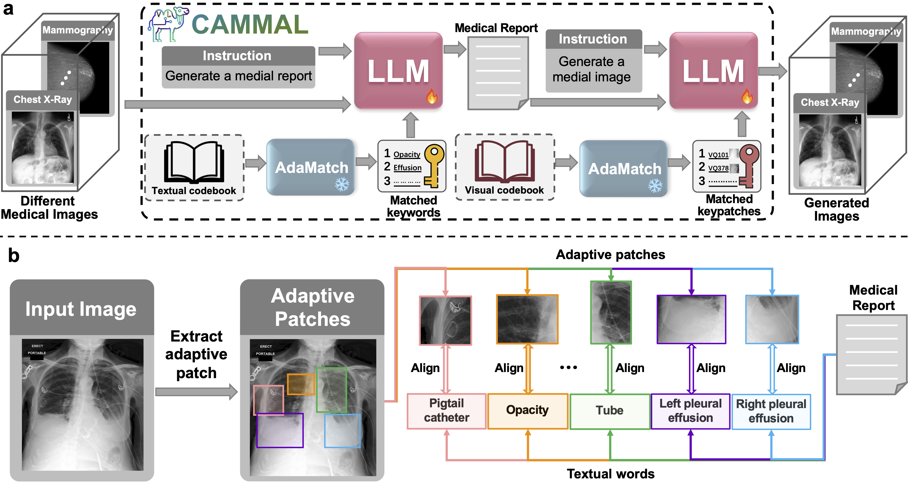

# CAMMAL
This repository is an official PyTorch implementation of the paper "Bridging Medical Imaging and Reports: Fine-Grained Multi-Modal Alignment for Enhanced Understanding of Radiology Practice".




###  1. Installation
To install Python dependencies:
```
pip install -r requirements.txt
```
To prepare gcc:
```
sudo yum install centos-release-scl
sudo yum install devtoolset-7-gcc*
scl enable devtoolset-7 bash
which gcc
gcc --version
```
To prepare java:
`yum install java-1.6.0-openjdk`
Since the image encoder of adaMatch is based on DPT, please compile CUDA operators:
```
cd ./adamatch/ops
sh ./make.sh
# unit test (should see all checking is True)
python test.py
```

### 2. Dataset downloading
Datasets we used are as follows:
- **MIMIC-CXR**: We downloaded the [MIMIC-CXR-JPG](https://physionet.org/content/mimic-cxr-jpg/2.0.0/) dataset as the radiographs. Paired medical reports can be downloaded in [MIMIC-CXR](https://physionet.org/content/mimic-cxr/2.0.0/mimic-cxr-reports.zip).

After downloading datasets, please check if the path in `src/constants.py` is correct.
We put all the images of mimic-cxr dataset into one folder `MIMIC_CXR_IMAGE_DIR=path_to_all_cxr_images`

### 3. Data Preprocessing
We preprocessed these datasets and split the dataset into train/val/test set using the code in `src/preprocess`.
Some preprocessed files are saved in `./materials` that can be found [here](https://drive.google.com/drive/folders/1s6oCwWIM-KYvGccBdKKXsSVD_DviZsJc?usp=drive_link).

### 4. Pre-training AdaMatch
We pre-trained AdaMatch on MIMIC-CXR using this command:
```
cd ./src/models/adamatch
CUDA_VISIBLE_DEVICES=0,1 python3 mgca_module.py --gpus 8 --strategy ddp \
--emb_dim 256 --learning_rate 6e-3 --weight_decay 3e-2 --batch_size 112 --max_epochs 15 \
--img_encoder dpt_medium --dpt_return_stage 3
```
We train our framework 15 epochs on 2 pieces of A100 GPUs with batch size of 112. It takes about *10 hours* to pre-train this model.
We adopt the DPT-medium as image encoder, which is pre-trained with chest x-ray classification. The pre-trained DPT-medium is located at `adamatch/materials/best_model.pth`.

Note that it is flexible to develop other pre-training models under this framework. You may create a folder in `src/models` and complete the `{MODEL_NAME}_module.py` file.

### 5. Preparing keyword and keypatch list

#### 1) Building the keyword list
In this part, we use ner model to extract entities first and rank in terms of their frequency.
```
cd ./src/models/adamatch/NER
sh ./lanuch/extract_keywrods_mimic.sh
```
The ranked keywords are saved to './NER/outputs_new/mimic_topk_words.csv'.
Please check them, remove some unnecessary words, and put them into a txt file in the following format.
```
keyword1
keyword2
keyword3
......
```
Please save keywords txt file to `./materials/mimic_top500_keywords.txt`. Or you can use the keywords file in `./materials/mimic_final_top500_clean.txt`.
#### 2) Get the keywords
Set the keywords list path in `adamatch/src/datasets/pretrain_dataset_test_token.py`, `keywords_path=path_to_keywords_list` 

Merge matched keywords into one pickle file
`sh ./launch/get_topk_keywords.sh`
The pickle file of keyword list is saved at `./adamatch/data/topk_word_list`

#### 3) Building the keypatch list
1. Get the similarity matrices for image-text pair (both trainset and testset)
```
cd ./adamatch/src
sh ./launch/test_dpt.sh 
```
2. Merge similarity matrices into a pickle file
```
cd ./adamatch/src/utils
python3 merge_topk_patches.py
```
3. Get topk raw patches and the corresponding vq codes
```
cd ./adamatch/src/utils
python3 get_topk_raw_patches_dpt.py
```
The keypatch list is saved at `./adamatch/data/topk_patch_list/topk_xxx_patches_list.pickle`
#### 4) Get the keypatches
Match topk keypatches for reports from trainset and testset
```
cd ./adamatch/src
sh ./launch/test_topk_patch_token_dpt.sh
```

### 5. Training CAMMAL
```
cd cyclic
sh ./train_adamatch_cyclic.sh
```

### 6. Testing CAMMAL
```
sh ./cyclic/lanuch/test_adamatch_cyclic.sh
```

# Contact
Our repository is still under construction. If you have any questions, please feel free to contact me. (wentichen7-c@my.cityu.edu.hk)